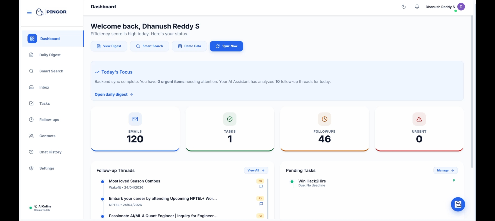
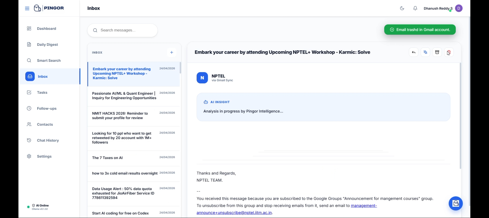
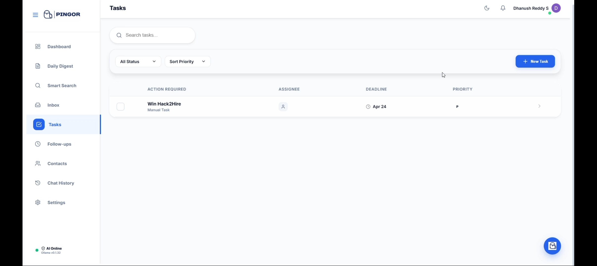
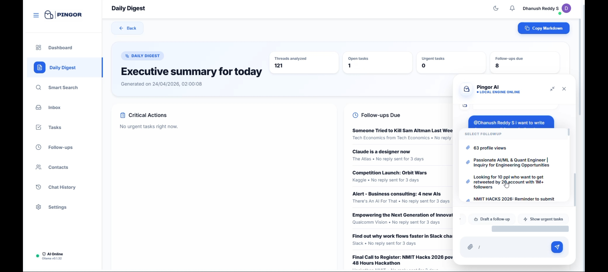

<p align="center">
  
</p>

<h2 align="center">Agentic Communication Assistant</h2>

<div align="center">

<br/>

*Built for the modern professional. Powered by local AI.*

<br/>

[](https://reactjs.org/)
[](https://nodejs.org/)
[](https://ollama.ai/)
[](https://langchain.com/)
[](https://developers.google.com/gmail)

</div>

---

## What is Pingor?

Email overload is a productivity killer. Pingor fixes that.

It's an agentic communication assistant that connects to your Gmail, uses a locally-hosted LLM to classify and prioritize every thread, extracts actionable tasks automatically, and puts everything into a clean, intelligent dashboard — so you can focus on deep work while Pingor handles the logistics.

No cloud AI subscriptions. No data sent to third parties. Everything runs locally.

---

## Problem Statement

Managing email effectively is one of the biggest productivity challenges for professionals. Important threads get buried, action items are missed, follow-ups fall through the cracks, and there's no easy way to search across conversations with natural language. Existing tools either require manual effort to organize or rely on cloud-based AI services that raise serious privacy concerns when processing sensitive communications.

Pingor addresses this by building an AI agent that connects to Gmail via OAuth2, automatically classifies and prioritizes every thread, extracts structured action items with owners and deadlines, detects stale threads needing follow-up, generates a daily digest of critical items, and supports natural language search across the entire inbox — all while processing everything locally through Ollama, ensuring no email content ever leaves the user's machine.

---

## Proposed Solution

Pingor is a local-first agentic email assistant that acts as an AI-powered executive assistant for your inbox. It uses a LangChain ReAct agent backed by a locally-running Llama 3.2 model (via Ollama) to analyze, classify, and summarize email threads in real time. The system syncs with Gmail on a 10-minute heartbeat, processes threads through an AI pipeline that tags categories, assigns priority scores, extracts tasks, and detects follow-up needs — then surfaces everything through an intuitive React dashboard with smart search, daily digests, and human-in-the-loop draft approval. All processing stays on-device, meeting strict privacy requirements while handling 100+ threads at scale.

---

## The Build — Day by Day

| Day | What We Shipped |
|-----|----------------|
| **01** | 🏗️ React frontend + Node/Express backend scaffolded · Google OAuth2 configured for Gmail API access |
| **02** | 🗃️ JSON data models defined (Threads, ActionItems, ChatSessions) · Node-Cron heartbeat sync implemented |
| **03** | 🤖 Ollama (Llama 3.2) integrated into sync pipeline · LangChain ReAct agent built with live Gmail tools (search, read, draft) · OAuth token caching added |
| **04** | 🖥️ Dashboard, Tasks, and Follow-ups pages built · Context Injection system (`/` and `@` triggers) added to chat · Draft Approval flow implemented |
| **05** | 🛠️ Refactored database operations to be asynchronous · Detail Modals scaffolded · Real-time Gmail Archive/Trash actions wired |
| **06** | 🎨 UI/UX overhaul · FloatingChat hook violations resolved · Quick Compose system completed · Advanced inbox filtering shipped |
| **07** | 📬 Full email body extraction with HTML rendering · One-click AI Reply generation · Auth flow stabilized · 10-minute heartbeat sync finalized |
| **08** | 🔍 Smart Search with natural language queries · Follow-up detection engine · Daily digest generation · 100+ thread demo data seeding · Dark mode fixes · Final UI polish |

---

## Features

**Intelligent Sync Engine**
Pingor polls Gmail every 10 minutes using a Node-Cron heartbeat. Threads are fetched in parallel batches, analyzed by the local LLM, and upserted into the database — all without touching external AI services.

**AI-Powered Classification**
Every email thread is automatically tagged (action-required, FYI, meeting-related, approval-pending, vendor/external, personal) and assigned a priority score from 1–5 using Ollama running locally.

**Agentic Chat with Context Injection**
The floating AI assistant supports `@sender` and `/task` or `/followup` triggers to inject live context from your inbox directly into the chat conversation. Ask it anything about your threads.

**Human-in-the-Loop Draft Approval**
When Pingor generates a reply, it doesn't send it. It puts it in a review queue where you can edit, approve, or reject — giving you final control before anything hits Gmail.

**Gmail-Native Actions**
Archive and trash emails directly from the Pingor UI. Changes reflect instantly in your actual Gmail inbox via the Gmail API.

**Full Email Rendering**
Read complete HTML email bodies — not just snippets — inside the Pingor inbox with full formatting preserved.

**One-Click AI Reply**
Select any thread and generate a professional draft reply in one click. The AI uses the thread's subject and content as context.

**Task & Follow-up Tracking**
Extracted action items are surfaced in a dedicated Tasks view with priority sorting, deadline tracking, status management, and multi-user assignment.

**Chat History**
Every AI conversation is persisted and accessible from the Chat History page. Resume any session exactly where you left off.

**Smart Search**
Natural language search across your entire inbox. Ask queries like "find all emails from Ravi about the budget where I have not responded yet" and get instant, relevant results powered by the local LLM.

**Follow-up Detection**
Automatically identifies threads where no response was received within a configurable number of days, and threads where someone is waiting on you — so nothing slips through the cracks.

**Daily Digest**
A prioritized daily summary that surfaces critical actions first, then pending follow-ups, then FYI items. Formatted as a clean, readable report with thread counts, open tasks, and urgency indicators.

**Local-First Privacy**
The AI engine (Ollama) runs entirely on your machine. Your emails never leave your environment.

---

## Tech Stack

| Layer | Technology |
|-------|-----------|
| **Frontend** | React 18, Lucide Icons, Framer Motion, Vanilla CSS |
| **Backend** | Node.js, Express.js |
| **Database** | Local JSON (offline-capable, zero external dependencies) |
| **AI Engine** | Ollama — Llama 3.2 (local) |
| **Agent Framework** | LangChain — ReAct Tool Calling Architecture |
| **Email API** | Gmail API via Google OAuth2 |
| **Scheduling** | Node-Cron — 10-minute heartbeat sync |

---

## Architecture

```
Gmail API
    │
    ▼
Node-Cron Heartbeat (every 10 min)
    │
    ▼
Batch Retrieval (parallel, 10 threads/batch)
    │
    ▼
Ollama AI Pipeline (classify → prioritize → summarize → extract tasks)
    │
    ▼
Local JSON Database (db.json)
    │
    ▼
React Frontend (Dashboard · Inbox · Tasks · Follow-ups · Chat)
```

---

## Setup

### Prerequisites

- [Node.js](https://nodejs.org/) v18+
- [Ollama](https://ollama.ai/) installed and running
- A Google Cloud project with Gmail API enabled and OAuth2 credentials

### 1. Pull the AI Model

```bash
ollama run llama3.2
```

### 2. Clone the Repository

```bash
git clone https://github.com/dhanushreddy370/H2H-CodeBlodded-Pingor.git
cd H2H-CodeBlodded-Pingor
```

### 3. Configure the Server

```bash
cd server
npm install
cp .env.example .env
```

Open `.env` and fill in your credentials:

```env
GMAIL_CLIENT_ID=your_google_client_id
GMAIL_CLIENT_SECRET=your_google_client_secret
GMAIL_REDIRECT_URI=http://localhost:5000/auth/callback
OLLAMA_BASE_URL=http://localhost:11434
OLLAMA_MODEL=llama3.2:latest
PORT=5000
```

```bash
npm run dev
```

### 4. Start the Client

```bash
cd ../client
npm install
npm start
```

The app will open at `http://localhost:3000`.

> **First Login:** Use "Sign in with Google" to connect your Gmail account. Pingor will trigger an initial sync automatically after authentication.

---

## Project Structure

```
H2H-CodeBlodded-Pingor/
├── client/
│   └── src/
│       ├── components/        # FloatingChat, DetailModal, Navbar, Sidebar
│       ├── context/           # AuthContext (session management)
│       ├── pages/             # Dashboard, Inbox, Tasks, FollowUps, Settings
│       └── App.js             # Root app with routing and layout
└── server/
    ├── agents/                # LangChain agent + Gmail tools
    ├── config/                # Gmail OAuth2 client configuration
    ├── routes/                # REST API (tasks, followups, threads, chat, auth...)
    ├── services/              # aiService, syncService, gmailService, dbService
    └── index.js               # Express server entry point
```

---

## API Reference

| Endpoint | Method | Description |
|----------|--------|-------------|
| `/api/auth/url` | GET | Get Google OAuth2 login URL |
| `/api/auth/callback` | GET | Handle OAuth callback, store tokens |
| `/api/sync/manual` | POST | Trigger an immediate Gmail sync |
| `/api/sync/status` | GET | Get current sync state and latest threads |
| `/api/threads` | GET | List all synced email threads |
| `/api/tasks` | GET/POST/PATCH | Manage action items |
| `/api/followups` | GET | List FYI threads and pending drafts |
| `/api/followups/approve/:id` | POST | Push approved draft to Gmail |
| `/api/chat/ask` | POST | Send a message to the AI assistant |
| `/api/contacts` | GET/POST/PATCH/DELETE | Manage contacts |
| `/api/history` | GET/POST | List and create chat sessions |
| `/api/search` | POST | Natural language smart search across threads |
| `/api/digest` | GET | Generate prioritized daily digest |
| `/api/demo/seed` | POST | Seed 100+ demo email threads for testing |

---

## Demo / Screenshots

- [Demo Video](https://drive.google.com/file/d/1eZVJiDM6lxR4uxuk6kAOucWS3i63eU1a/view?usp=sharing)
- [Code Documentation and Architectural Flow](https://drive.google.com/file/d/1i_snBNygTyNAm9Ze0qS_GgASaL0_SWB6/view?usp=sharing)
- [Privacy Policy Write-up and Extention Plan for Slack/Teams](https://drive.google.com/file/d/1pKitRJBWM99swUpwOkwxWw_VcPM2xskh/view?usp=sharing)

<table>
  <tr>
    <td width="50%"><br/><sub><b>Dashboard</b> — Prioritized overview with thread stats and quick actions</sub></td>
    <td width="50%"><br/><sub><b>Inbox</b> — AI-classified threads with category tags and priority scores</sub></td>
  </tr>
  <tr>
    <td width="50%"><br/><sub><b>Tasks</b> — Extracted action items with deadlines and owner assignment</sub></td>
    <td width="50%"><br/><sub><b>Daily Digest</b> — Prioritized summary of critical actions and follow-ups</sub></td>
  </tr>
</table>

---

## Team

**CodeBlooded** — built for the H2H Hackathon

<p align="center">
  
</p>

| Name | Role |
|------|------|
| Dhanush Reddy S | Team Lead · Backend Architecture · AI Pipeline |
| M Rithika | Frontend Development · UI/UX · Integration |

---

<div align="center">
<sub>Built with ☕ and zero sleep · CodeBlooded Team · 2026</sub>
</div>
