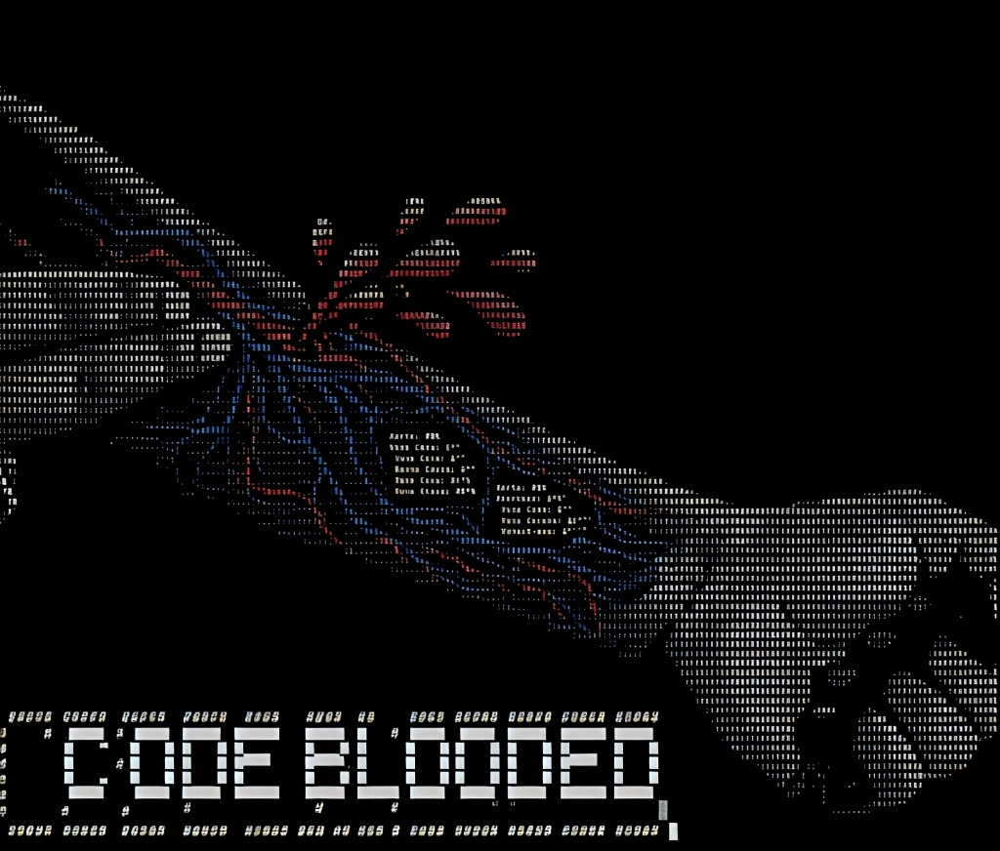

<p align="center">
  
</p>

<h2 align="center">Agentic Communication Assistant</h2>

<div align="center">

<br/>

*Built for the modern professional. Powered by local AI.*

<br/>

[](https://reactjs.org/)
[](https://nodejs.org/)
[](https://ollama.ai/)
[](https://langchain.com/)
[](https://developers.google.com/gmail)

</div>

---

## What is Pingor?

Email overload is a productivity killer. Pingor fixes that.

It's an agentic communication assistant that connects to your Gmail, uses a locally-hosted LLM to classify and prioritize every thread, extracts actionable tasks automatically, and puts everything into a clean, intelligent dashboard — so you can focus on deep work while Pingor handles the logistics.

No cloud AI subscriptions. No data sent to third parties. Everything runs locally.

---

## The Build — Day by Day

| Day | What We Shipped |
|-----|----------------|
| **01** | 🏗️ React frontend + Node/Express backend scaffolded · Google OAuth2 configured for Gmail API access |
| **02** | 🗃️ JSON data models defined (Threads, ActionItems, ChatSessions) · Node-Cron heartbeat sync implemented |
| **03** | 🤖 Ollama (Llama 3.2) integrated into sync pipeline · LangChain ReAct agent built with live Gmail tools (search, read, draft) · OAuth token caching added |
| **04** | 🖥️ Dashboard, Tasks, and Follow-ups pages built · Context Injection system (`/` and `@` triggers) added to chat · Draft Approval flow implemented |
| **05** | ☁️ Migrated to MongoDB Atlas for multi-user persistence · Detail Modals scaffolded · Real-time Gmail Archive/Trash actions wired |
| **06** | 🎨 UI/UX overhaul · FloatingChat hook violations resolved · Quick Compose system completed · Advanced inbox filtering shipped |
| **07** | 📬 Full email body extraction with HTML rendering · One-click AI Reply generation · Auth flow stabilized · 10-minute heartbeat sync finalized |

---

## Features

**Intelligent Sync Engine**
Pingor polls Gmail every 10 minutes using a Node-Cron heartbeat. Threads are fetched in parallel batches, analyzed by the local LLM, and upserted into the database — all without touching external AI services.

**AI-Powered Classification**
Every email thread is automatically tagged (action-required, FYI, meeting-related, approval-pending, vendor/external, personal) and assigned a priority score from 1–5 using Ollama running locally.

**Agentic Chat with Context Injection**
The floating AI assistant supports `@sender` and `/task` or `/followup` triggers to inject live context from your inbox directly into the chat conversation. Ask it anything about your threads.

**Human-in-the-Loop Draft Approval**
When Pingor generates a reply, it doesn't send it. It puts it in a review queue where you can edit, approve, or reject — giving you final control before anything hits Gmail.

**Gmail-Native Actions**
Archive and trash emails directly from the Pingor UI. Changes reflect instantly in your actual Gmail inbox via the Gmail API.

**Full Email Rendering**
Read complete HTML email bodies — not just snippets — inside the Pingor inbox with full formatting preserved.

**One-Click AI Reply**
Select any thread and generate a professional draft reply in one click. The AI uses the thread's subject and content as context.

**Task & Follow-up Tracking**
Extracted action items are surfaced in a dedicated Tasks view with priority sorting, deadline tracking, status management, and multi-user assignment.

**Chat History**
Every AI conversation is persisted and accessible from the Chat History page. Resume any session exactly where you left off.

**Local-First Privacy**
The AI engine (Ollama) runs entirely on your machine. Your emails never leave your environment.

---

## Tech Stack

| Layer | Technology |
|-------|-----------|
| **Frontend** | React 18, Lucide Icons, Framer Motion, Vanilla CSS |
| **Backend** | Node.js, Express.js |
| **Database** | Local JSON (offline-capable, zero external dependencies) |
| **AI Engine** | Ollama — Llama 3.2 (local) |
| **Agent Framework** | LangChain — ReAct Tool Calling Architecture |
| **Email API** | Gmail API via Google OAuth2 |
| **Scheduling** | Node-Cron — 10-minute heartbeat sync |

---

## Architecture

```
Gmail API
    │
    ▼
Node-Cron Heartbeat (every 10 min)
    │
    ▼
Batch Retrieval (parallel, 10 threads/batch)
    │
    ▼
Ollama AI Pipeline (classify → prioritize → summarize → extract tasks)
    │
    ▼
Local JSON Database (db.json)
    │
    ▼
React Frontend (Dashboard · Inbox · Tasks · Follow-ups · Chat)
```

---

## Setup

### Prerequisites

- [Node.js](https://nodejs.org/) v18+
- [Ollama](https://ollama.ai/) installed and running
- A Google Cloud project with Gmail API enabled and OAuth2 credentials

### 1. Pull the AI Model

```bash
ollama run llama3.2
```

### 2. Clone the Repository

```bash
git clone https://github.com/dhanushreddy370/H2H-CodeBlodded-Pingor.git
cd H2H-CodeBlodded-Pingor
```

### 3. Configure the Server

```bash
cd server
npm install
cp .env.example .env
```

Open `.env` and fill in your credentials:

```env
GMAIL_CLIENT_ID=your_google_client_id
GMAIL_CLIENT_SECRET=your_google_client_secret
GMAIL_REDIRECT_URI=http://localhost:5000/auth/callback
OLLAMA_BASE_URL=http://localhost:11434
OLLAMA_MODEL=llama3.2:latest
PORT=5000
```

```bash
npm run dev
```

### 4. Start the Client

```bash
cd ../client
npm install
npm start
```

The app will open at `http://localhost:3000`.

> **First Login:** Use "Sign in with Google" to connect your Gmail account. Pingor will trigger an initial sync automatically after authentication.

---

## Project Structure

```
H2H-CodeBlodded-Pingor/
├── client/
│   └── src/
│       ├── components/        # FloatingChat, DetailModal, Navbar, Sidebar
│       ├── context/           # AuthContext (session management)
│       ├── pages/             # Dashboard, Inbox, Tasks, FollowUps, Settings
│       └── App.js             # Root app with routing and layout
└── server/
    ├── agents/                # LangChain agent + Gmail tools
    ├── config/                # Gmail OAuth2 client configuration
    ├── routes/                # REST API (tasks, followups, threads, chat, auth...)
    ├── services/              # aiService, syncService, gmailService, dbService
    └── index.js               # Express server entry point
```

---

## API Reference

| Endpoint | Method | Description |
|----------|--------|-------------|
| `/api/auth/url` | GET | Get Google OAuth2 login URL |
| `/api/auth/callback` | GET | Handle OAuth callback, store tokens |
| `/api/sync/manual` | POST | Trigger an immediate Gmail sync |
| `/api/sync/status` | GET | Get current sync state and latest threads |
| `/api/threads` | GET | List all synced email threads |
| `/api/tasks` | GET/POST/PATCH | Manage action items |
| `/api/followups` | GET | List FYI threads and pending drafts |
| `/api/followups/approve/:id` | POST | Push approved draft to Gmail |
| `/api/chat/ask` | POST | Send a message to the AI assistant |
| `/api/contacts` | GET/POST/PATCH/DELETE | Manage contacts |
| `/api/history` | GET/POST | List and create chat sessions |

---

## Team

**CodeBlooded** — built for the H2H Hackathon

<p align="center">
  
</p>

| Name | Role |
|------|------|
| Dhanush Reddy S | Team Lead · Backend Architecture · AI Pipeline |
| M Rithika | Frontend Development · UI/UX · Integration |

---

<div align="center">
<sub>Built with ☕ and zero sleep · CodeBlooded Team · 2026</sub>
</div>
